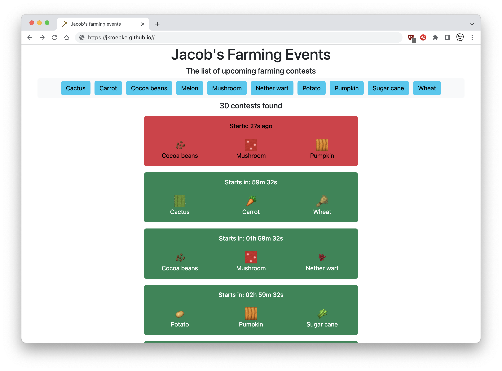

# hypixel-skyblock-jacobs-farming-api

Webpage and API for Jacobs farming events on Hypixel Skyblock

Page: [https://jacobs.jkroepke.de/](https://jacobs.jkroepke.de/)

<p align="center">
  
</p>

# External data access for plugins

All jacob farming event data are available as json.

## index.json

[https://jacobs.jkroepke.de/data/index.json](https://jacobs.jkroepke.de/data/index.json)

### Structure

```json
{
  "#Skyblock Year": {
    "url": "data/#Skyblock_Year.json",
    "from": "first contest data in the year",
    "to": "latest contest data in the year"
  }
}
```
## data/#Skyblock_Year.json

[https://jacobs.jkroepke.de/data/#Skyblock_Year.json](https://jacobs.jkroepke.de/data/215.json)

### Structure

```json
{
  "time of event 1 (unix timestamp in ms)": ["crop 1","crop 2","crop 3"],
  "time of event 2 (unix timestamp in ms)": ["crop 1","crop 2","crop 3"]
}
```

Possible values for crops:
- Cactus
- Sugar Cane
- Nether Wart
- Wheat
- Mushroom
- Cocoa Beans
- Potato
- Melon
- Pumpkin
- Carrot
